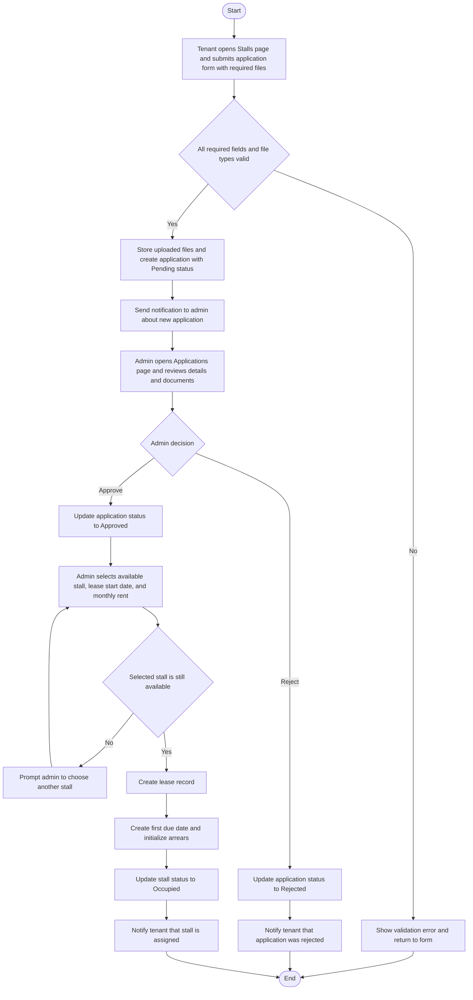

# RentFlow System Diagrams

## Level 0: Context Diagram

```mermaid
flowchart LR
    T[Tenant]
    A[Admin]
    C[Cron Scheduler]
    E[Email Service (SendGrid or SMTP)]
    D[(MySQL Database)]
    F[(File Storage uploads)]
    S([RentFlow Rent Management System])

    T -->|Register or Login, Apply for Stall, View Payments, Send Support Messages| S
    S -->|Notifications, Lease and Payment Updates, OTP and Confirmation Prompts| T

    A -->|Manage Tenants and Stalls, Review Applications, Record Payments, Run Reports| S
    S -->|Dashboards, Alerts, Analytics, Export Data| A

    <!-- Treasury removed from system diagrams -->

    C -->|Trigger penalty and overdue processing jobs| S

    S -->|Send OTP, registration, password reset, and system emails| E
    E -->|Delivery response| S

    S <--> D
    S <--> F
```

## Level 1: Decomposition Diagram

```mermaid
flowchart TB
    Tenant[Tenant]
    Admin[Admin]
    <!-- Treasury removed -->
    Visitor[Visitor]
    Scheduler[Cron Scheduler]
    DB[(MySQL Database)]
    Mail[Email Service]
    Files[(Uploads Storage)]

    subgraph RF[RentFlow]
        M1[Authentication and Account Module]
        M2[Stall Application and Allocation Module]
        M3[Lease, Payments, Dues, Arrears Module]
        M4[Notifications and Support Chat Module]
        M5[Reporting and Export Module]
    end

    Visitor --> M1
    Tenant --> M1
    Tenant --> M2
    Tenant --> M3
    Tenant --> M4

    Admin --> M1
    Admin --> M2
    Admin --> M3
    Admin --> M4
    Admin --> M5

    <!-- Treasury connections removed -->

    Scheduler --> M3

    M1 <--> DB
    M2 <--> DB
    M3 <--> DB
    M4 <--> DB
    M5 <--> DB

    M1 --> Mail
    M4 --> Mail

    M2 <--> Files
    M4 <--> Files
```

## Use Case Diagram

```mermaid
flowchart LR
    V[Visitor]
    T[Tenant]
    A[Admin]
    S[Scheduler]

    subgraph UC[RentFlow Use Cases]
        U1([Register Tenant Account])
        U2([Confirm Account via Code])
        U3([Login])
        U4([Verify OTP 2FA])
        U5([Reset Password via OTP])
        U6([Apply for Stall with Documents])
        U7([View Stalls and Lease Info])
        U8([View Dues, Payments, and Arrears])
        U9([Send Support Message or Chat])
        U10([View Notifications])
        U11([Manage Stalls and Tenants])
        U12([Review Stall Applications])
        U13([Approve or Reject Application])
        U14([Assign Stall and Create Lease])
        U15([Record Payment or Partial Payment])
        U16([Handle Arrears or Adjustments])
        U17([Generate Reports and Exports])
        U18([Apply Overdue Penalties])
    end

    V --> U1
    V --> U2
    V --> U3
    V --> U5

    T --> U3
    T --> U4
    T --> U6
    T --> U7
    T --> U8
    T --> U9
    T --> U10

    A --> U3
    A --> U11
    A --> U12
    A --> U13
    A --> U14
    A --> U15
    A --> U17
    A --> U9
    A --> U10

    <!-- Treasury use cases removed -->

    S --> U18

    U13 --> U14
    U15 --> U16
    U3 -. if 2FA is enabled .-> U4
```

## Activity Diagram
### Tenant Stall Application to Stall Assignment


